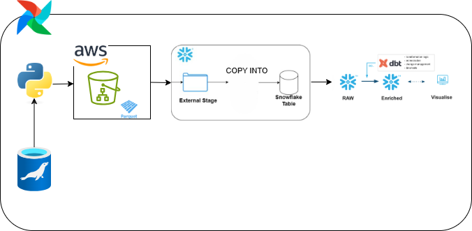

# Dimensional Modeling Data Engineering Project

## Introduction
This project demonstrates a modern data engineering pipeline using AWS S3, Snowflake, DBT, and Airflow. Raw data is ingested from a relational database into S3, orchestrated via Airflow to load and transform data into Snowflake using DBT. The project follows a dimensional modeling approach for scalable analytics and supports end-to-end automation of data ingestion, transformation, and reporting.

## Architecture

## Technology Used
1. Programming Language - Python (For data extraction scripts and orchestration tasks)
2. Scripting Language - SQL (For data and modeling)
3. Amazon Web services (AWS)
   - Cloud Storage
4. MariaDB – Source relational database used for raw data
5. Snowflake – Cloud data warehouse for storing and querying structured data
6. DBT (Data Build Tool) – For data transformation, testing, and modeling
7. Airflow – Workflow orchestration for scheduling and monitoring ETL pipelines

## Dataset Used
Classic Models Database

The project uses the Classic Models dataset, a well-known sample relational database that simulates a small-scale business scenario. It contains data for a fictitious company that sells automobile scale models, allowing for robust dimensional modeling and analytics

Key Tables:
- customers, orders, orderdetails, products, payments
- employees, offices
  
Relational Model - https://relational.fel.cvut.cz/assets/img/datasets-generated/classicmodels.svg

Original Data Source - https://relational.fel.cvut.cz/dataset/ClassicModels

## Dataset Model

